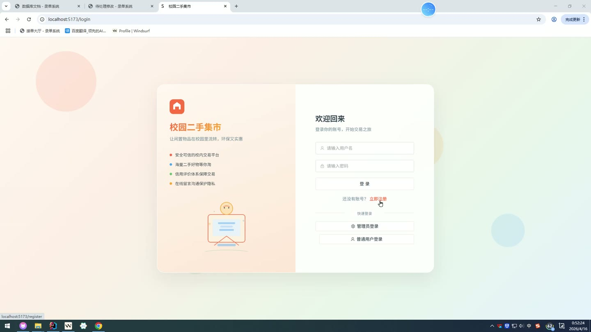
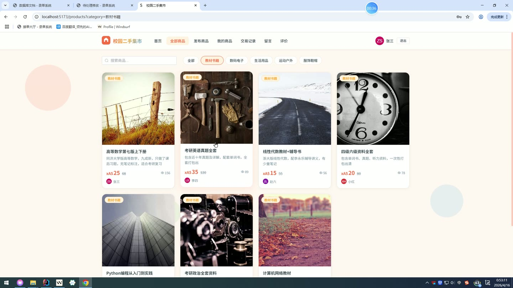
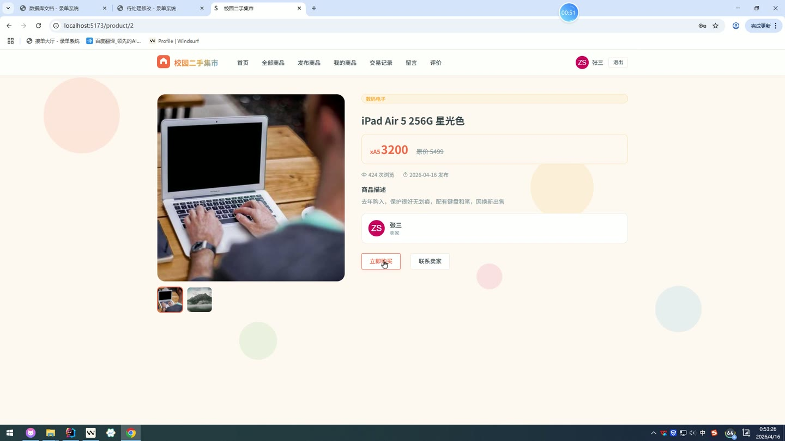
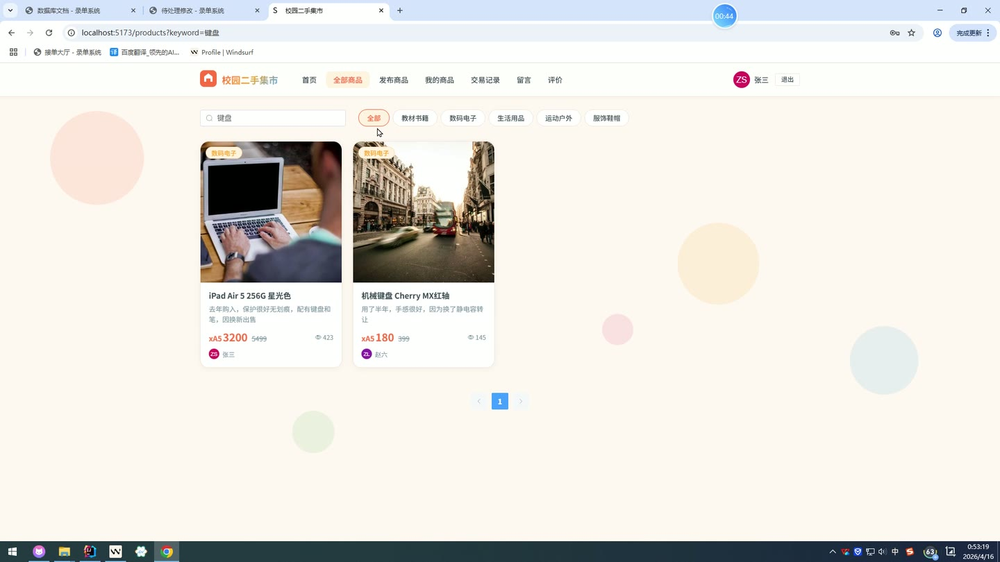
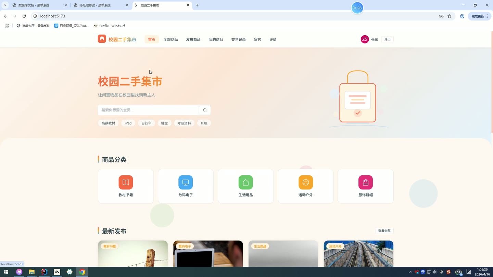

# (附文档)Springboot3+Vue3+MySQL 校园二手商品交易系统

**技术栈**：Springboot3、Vue3、MySQL

### 系统简介

校园二手商品交易系统是一套基于 Spring Boot 3 + Vue 3 前后端分离的校园闲置物品交易平台。系统分为普通用户端和管理员端两大角色，支持商品发布、商品浏览、在线下单、交易管理、站内留言、信用评价等完整交易流程，为校园用户提供安全便捷的二手物品交易服务。
 
### 核心功能
 
### 普通用户端

 
- 用户注册：填写用户名、密码、昵称等完成账号注册，密码自动 MD5 加密存储 
- 用户登录：输入用户名和密码进行登录，系统自动校验账号状态（待审核/正常/禁用） 
- 个人信息管理：查看和修改个人资料（昵称、头像、手机、邮箱等） 
- 商品搜索：按关键词（标题/描述）或分类筛选商品列表，支持分页浏览 
- 商品详情查看：点击商品卡片进入详情页，查看完整描述、价格、图片及卖家信息 
- 发布商品：填写商品标题、描述、价格、原价、分类、图片等信息上架商品 
- 我的商品：查看自己发布的所有商品列表，支持对在售商品执行下架操作 
- 商品编辑：对已发布的商品信息进行修改更新（标题、描述、价格等） 
- 创建订单：对在售商品发起购买，系统自动生成唯一订单号并锁定商品状态为“已售” 
- 我的订单：查看作为买家或卖家参与的所有订单，按时间倒序排列 
- 订单状态操作：对订单进行“确认交易”、“完成交易”、“取消订单”等状态流转 
- 站内留言：针对特定商品向卖家发送私信，支持双向沟通 
- 留言会话查看：按商品+对方用户维度聚合显示留言会话列表 
- 留言已读标记：查看会话时自动将未读消息标记为已读 
- 交易评价：对已完成的订单进行评分（1-5 星）和文字评价 
- 用户信用评分：系统根据收到的评价平均分自动更新用户的信用评分 
- 查看他人评价：浏览指定用户的收到的全部评价列表 
- 退出登录：清除当前会话，安全退出系统
 
### 管理员端

 
- 控制台概览：展示系统核心统计数据，包括用户总数、商品总数、订单总数、在售商品数、已完成订单数、待审核用户数 
- 用户管理：查看全部用户列表，支持按用户名/昵称关键词搜索 
- 用户状态管理：对用户账号进行启用、禁用、待审核等状态切换 
- 商品管理：查看全部商品列表，支持按关键词、分类、状态多维度筛选 
- 商品状态管理：对违规商品执行下架操作，修改商品状态为“违规下架” 
- 交易监控：查看全平台所有订单列表，按创建时间倒序排列 
- 数据统计：查看平台运营数据概览面板
 
### 技术栈

 后端框架Spring Boot 3.x ORMMyBatis-Plus（自动分页、逻辑删除、自动填充） 权限校验HttpSession 会话管理，角色字段区分 USER/ADMIN 前端框架Vue 3（Composition API + script setup） 状态管理Vue Router（前端路由） 构建工具Vite 数据库MySQL 8.x UI 组件库Element Plus 工具库Hutool（MD5 加密、UUID 生成）
 
### 交付内容

 
- 后端完整源码 
- 前端完整源码 
- 数据库初始化脚本 
- 万字文档

## 界面展示

---

## 获取完整源码 + 万字文档

本仓库为项目介绍页。**完整前后端源码、数据库初始化脚本、万字项目文档**，请加微信 `kangkangcode`，或访问 [codekk.top](http://codekk.top) 获取。

可作课程设计 / 毕业设计参考，支持远程部署调试。